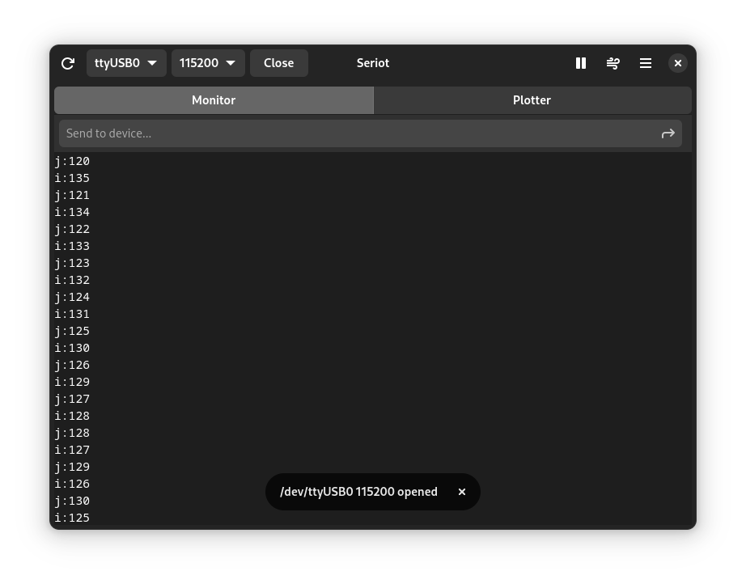
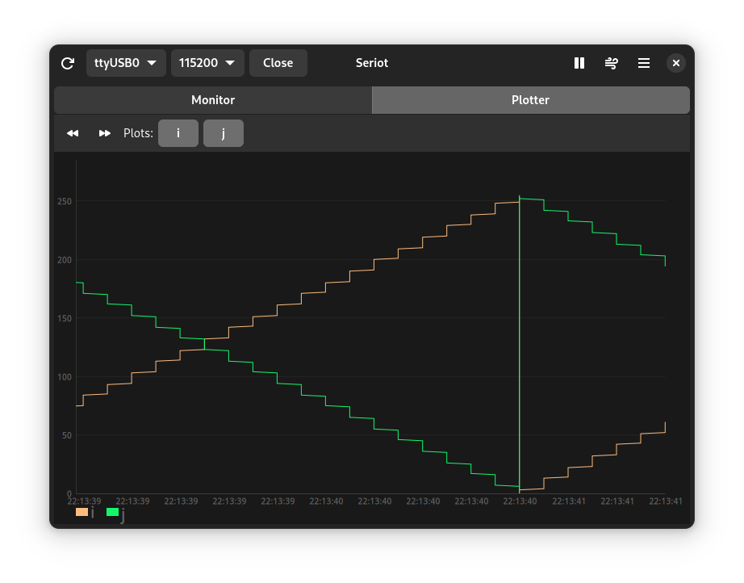
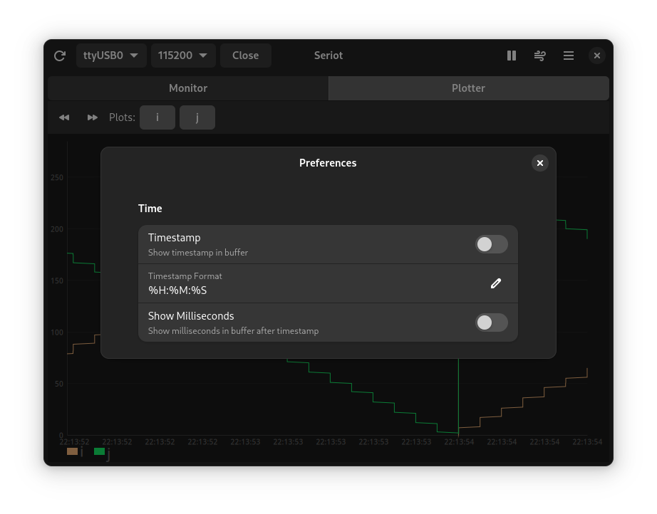
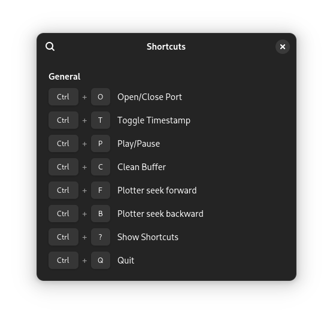

# Seriot
(say-ree-ot)

A GNOME desktop serial monitor and serial plotter.

## Features
- Play/Pause
- Timestamps
- Serial Plotter - plot incoming data
- Enable/Disable plots
- Rewind/Forward plots

## Screenshots






## Install from package
Install via AUR package [seriot-git](https://aur.archlinux.org/packages/seriot-git).

## Install from Source

### Dependencies

#### Build Dependencies
```
pkgconf
vala
meson
```
#### Runtime Dependencies
```
gtk4
libadwaita
glib2
libgee
cairo
```
### Install
```bash
meson setup build --prefix=/usr --libdir=lib
meson compile -C build
meson install -C build
```

## Troubleshooting
Depending on your system, permissions to get usb read/write access would be required

For Arch ppl - 

Create a file `/etc/udev/rules.d/01-ttyusb.rules` containing
```
SUBSYSTEMS=="usb-serial", TAG+="uaccess"
```
([Accessing Serial on Arch](https://wiki.archlinux.org/title/Arduino#Accessing_serial))

For Ubuntu folks -
```bash
sudo usermod -a -G dialout $USER
sudo usermod -a -G plugdev $USER
```

## Credits
1. [Livechart Library](https://github.com/lcallarec/live-chart) - Charting library for vala with gtk4
2. [Tauno Monitor](https://github.com/taunoe/tauno-monitor) - A gtk4 serial monitor in python
